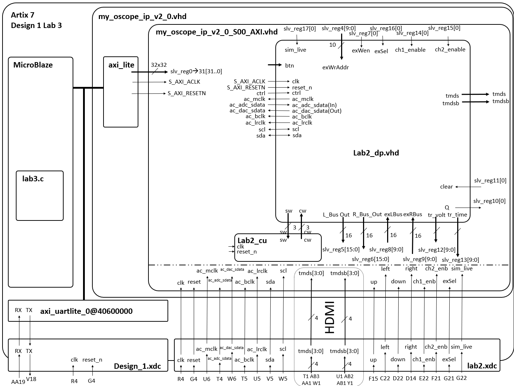

**Lab 3 Summary:**

The purpose of Lab 3 was to learn how to use a soft-core processor, specifically the MicroBlaze, to control a custom hardware datapath in an embedded system. This lab integrated previous work on a video oscilloscope (from Lab 2) with software control, allowing the user to dynamically adjust and trigger waveform displays.

The end functionality of Lab 3 was a fully functioning oscilloscope system that uses the MicroBlaze processor to:
- Collect audio samples from the codec using polling or interrupts,
- Store those samples in circular buffers,
- Detect trigger events based on user-specified trigger voltage and time,
- Display triggered waveforms on screen by writing processed samples to BRAM,
- Allow real-time user interaction via UART to modify trigger settings and channel display options,
- Operate in continuous mode for live waveform visualization.

Overall, this lab taught students how to interface software with hardware components using AXI registers, implement interrupt-driven data collection, and manage real-time user input in an embedded FPGA environment.

| Milestone           | Date/Time   | What was achieved                                                                 |
|---------------------|-------------|------------------------------------------------------------------------------------|
| Gate Check 1        | 3/18/2025   | Submitted updated Lab 2 block diagram and AXI register mapping for MicroBlaze I/O |
| Gate Check 2        | 4/05/2025   | Verified Lab 2 datapath control via MicroBlaze with ExSel set to ‘0’              |
| Gate Check 3        | 4/30/2025   | Demonstrated UART terminal interface for adjusting and displaying trigger values  |

### MicroBlaze Registers (in = read; out = write)

| Signal        | Direction | Register / Bits     |
|---------------|-----------|---------------------|
| exWrAddr      | write     | slv_reg4[9:0]       |
| exWen         | write     | slv_reg7[0]         |
| L_bus_out     | read      | slv_reg5[15:0]      |
| R_bus_out     | read      | slv_reg6[15:0]      |
| exLbus        | write     | slv_reg8[9:0]       |
| exRbus        | write     | slv_reg9[9:0]       |
| flagQ_ready   | read      | slv_reg10[0]        |
| flagClear     | write     | slv_reg11[0]        |
| Trig_Volt?    | write     | slv_reg13[9:0]      |
| Trig_Time?    | write     | slv_reg14[9:0]      |
| ch1_enb       | write     | ----                |
| ch2_enb       | write     | ----                |
| exSel         | write     | ----                |
| sim_live      | write     | ----                |

---

### Outside Artix-7 (lab2.xdc)

| Signal       | Type          | Package Pin |
|--------------|---------------|-------------|
| clk          | clock         | R4          |
| reset        | button        | G4          |
| ac_mclk      | Audio Codec   | U6          |
| ac_adc_sdata | Audio Codec   | T4          |
| ac_dac_sdata | Audio Codec   | W6          |
| ac_bclk      | Audio Codec   | T5          |
| ac_lrclk     | Audio Codec   | U5          |
| sda          | QSPI          | V5          |
| scl          | QSPI          | W5          |
| tmds[3:0]    | HDMI out      | T1 AB3 AA1 W1 |
| tmdsb[3:0]   | HDMI out      | U1 AB2 AB1 Y1 |
| up           | button        | F15         |
| left         | button        | C22         |
| sim_live     | button        | D22         |
| right        | button        | D14         |
| ch1_enb      | switch        | E22         |
| ch2_enb      | switch        | F21         |
| exSel        | switch        | G21         |
| sim_live     | switch        | G22         |

### Lab 5 Block Diagram

The diagram below shows the system architecture for Lab 5, illustrating how various components are connected and controlled.

*Click the image to view it full-size.*
